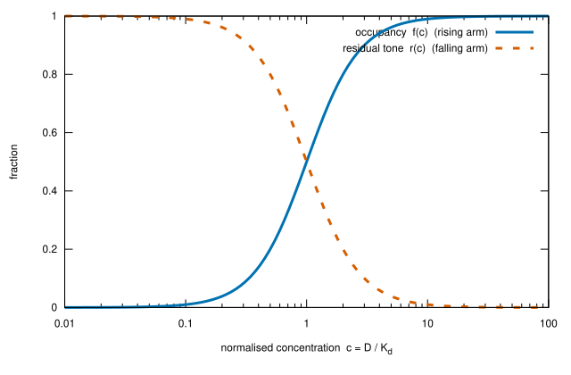
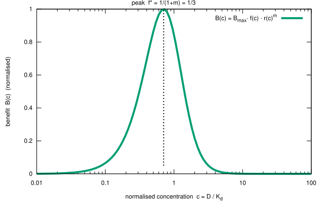

Sie haben LDN über einen längeren Zeitraum mit 4 mg ausprobiert. Kein Nutzen. Sie erwägen, eine niedrigere Dosis zu testen — 1 mg, sagen wir — und eine Überlegung drängt sich auf: Wenn 4 mg nichts bewirkten, werden 1 mg auch nichts bewirken. Das Größere enthält das Kleinere.

Es ist das allgemeine Denkmuster, dass ein größeres Ergebnis ein kleineres enthalten muss — angewendet auf die Pharmakologie. Es klingt vernünftig. Für LDN ist es falsch.

Dieser Artikel erklärt, warum — nicht, indem er jemandem einen Fehler zuschreibt, sondern indem er zeigt, was diese Schlussfolgerung stillschweigend voraussetzt — und warum diese Annahme nicht hält, wenn ein Medikament mehrere Ziele bei unterschiedlichen Konzentrationen trifft.

---

## Die kurze Antwort

Das gesamte Argument passt in einen Absatz und eine Tabelle. Der detaillierte Beweis — der trennt, was etablierte Wissenschaft und was ein vorgeschlagenes Modell ist — folgt danach.

Der Niedrigdosis-Nutzen von LDN hängt von einer **partiellen** Blockade seines Rezeptors ab: Die Zelle muss noch ein Restsignal spüren, um ihre kompensatorische antiinflammatorische Antwort aufzubauen. Ob ein Rezeptor partiell oder vollständig blockiert ist, wird durch die Medikamentenkonzentration relativ zur Sensitivität dieses Rezeptors festgelegt — das Verhältnis $c = D/K_d$, Dosis geteilt durch die Dissoziationskonstante des Rezeptors. Dosis erhöhen, und $c$ steigt; der Anteil $f$ blockierter Rezeptoren klettert gegen 100 %. Bei 1 mg sitzt der mikrogliale Rezeptor TLR4 in der Zone partieller Blockade, und der Nutzenmechanismus läuft. Bei 4 mg ist derselbe Rezeptor fast vollständig blockiert, das Restsignal ist verschwunden, und **der 1-mg-Mechanismus ist ausgeschaltet — nicht verstärkt.** Gleichzeitig aktiviert 4 mg ein anderes Ziel (TRPM3), das 1 mg nie erreicht. Ein Nulleffekt bei 4 mg hat daher den 4-mg-Mechanismus getestet. Er hat den 1-mg-Mechanismus nicht getestet — dieser Mechanismus lief während der 4-mg-Prüfung nicht.

Die Zahlen machen das konkret. Die Besetzungsspalte nutzt die Standard-Hill-Gleichung $f = c^2/(1+c^2)$ (etablierte Pharmakologie); die Nutzenspalte nutzt das einfache Modell $B \propto f(1-f)^2$, das in Teil B dieses Artikels vorgeschlagen wird (eine Hypothese). Die Parameterwahl ist illustrativ und ungemessen: $K_d = 1$ mg, der Hill-Koeffizient $n = 2$ und der Steilheitsexponent $m = 2$ (das allgemeine Modell in Teil B lässt $n$ und $m$ frei):

| Dosis | $c = D/K_d$ | $f$ — blockierte Rezeptoren | $1-f$ — Restsignal | Nutzen, relativ zum Gipfel (vorgeschlagenes Modell) |
|-------|------------|------------------------------|---------------------|------------------------------------------------------|
| 0,7 mg | 0,7 | 0,33 | 0,67 | **1,00 — der Gipfel** |
| 1 mg | 1,0 | 0,50 | 0,50 | 0,84 |
| 3 mg | 3,0 | 0,90 | 0,10 | 0,06 |
| 4 mg | 4,0 | 0,94 | 0,06 | 0,02 |

Lesen Sie die Tabelle von unten nach oben. Ein Nulleffekt bei 4 mg betrifft nur die letzte Zeile. Über die ersten zwei Zeilen sagt er nichts, denn diese Zeilen beschreiben einen Zustand — partielle Blockade —, den eine 4-mg-Dosis nie erzeugt. Und 3 mg ist wieder ein anderes Experiment: Das Niedrigdosis-Fenster hat sich auch dort geschlossen, aber dort binden andere Mechanismen — das Endorphin-Plateau und das sich öffnende TRPM3-Fenster. Jede Dosis ist ein anderes Experiment, und das Scheitern der einen verurteilt keine der anderen.

Eine Klarstellung: Einen Nutzen auszuschalten ist nicht dasselbe wie Schaden anzurichten. Bei 4 mg läuft der Niedrigdosis-Mechanismus einfach nicht — der Patient befindet sich auf seiner unbehandelten Basislinie für diesen Pfad, nicht darunter. Die 4-mg-Erfahrung ist daher ein Nulleffekt, keine Verschlechterung — und ein Nulleffekt ist nur eine Information über den Zustand, der tatsächlich getestet wurde.

---

## Die Schlussfolgerung beruht auf einer unausgesprochenen Annahme

Das Argument „wenn 4 mg nicht wirken, wirken 1 mg nicht" ist nur gültig, wenn eine Bedingung erfüllt ist:

> **Die Obermengen-Hypothese:** Die Wirkungen einer niedrigeren Dosis sind eine Teilmenge der Wirkungen einer höheren Dosis.

Wenn das zutrifft, dann testet die höchste Dosis *jede* Dosis. Ein Fehlversuch bei der hohen Dosis ist ein Fehlversuch bei allen. Die Schlussfolgerung ist sauber, einfach und spart mehrere Versuche.

Das Problem: Diese Hypothese gilt nur für ein Medikament, das **ein einziges Ziel** mit einer **monotonen Dosis-Wirkungs-Kurve** trifft. LDN ist keines von beidem.

---

## Die Chemie: warum eine höhere Dosis keine größere Dosis ist

Die Obermengen-Annahme behandelt die Dosis wie einen Lautstärkeregler — mehr Medikament, mehr derselben Wirkung. Doch LDN ist ein hormetisches Multi-Target-Medikament, und das ändert alles.

### Was ein Rezeptor ist und warum eine Dosis zu niedrig sein kann

Der Artikel beruht auf einem Bild davon, wie ein Medikament und ein Rezeptor interagieren. Dieser Unterabschnitt legt dieses Bild dar und trennt etablierte Biologie von der Hypothese des Artikels.

**Was ein Rezeptor ist (etabliert).** Ein Rezeptor ist ein Protein — meist an der Zelloberfläche — an das ein Signalstoff oder ein Medikament bindet. Die Bindung bewirkt etwas im Inneren der Zelle: Ein **Agonist** ahmt das natürliche Signal nach und schaltet eine Antwort ein; ein **Antagonist** bindet dieselbe Stelle, blockiert das natürliche Signal und schaltet es aus. Für die Dosierung ist die relevante Größe der **Anteil besetzter Rezeptoren** — der Anteil der Kopien dieses Rezeptors an der Zelle, die ein Medikamentenmolekül tragen. Die Hill-Gleichung aus Teil A3 verwandelt eine Konzentration in diesen Anteil.

**Warum dieser Anteil der Konzentration folgt (etabliert).** Die Bindung ist ein reversibles Gleichgewicht, $D + R \rightleftharpoons DR$. Die Dissoziationskonstante $K_d$ ist das Verhältnis der beiden Raten — wie schnell das Medikament abfällt über wie schnell es bindet. Eine Konzentration gleich $K_d$ besetzt die Hälfte der Rezeptoren; weit darüber fast alle; weit darunter fast keine. Deshalb zieht sich das dimensionslose Verhältnis $c = D/K_d$ durch den Artikel: Es misst eine Konzentration in Einheiten der Empfindlichkeit des Rezeptors. (Massenwirkungs-, Langmuir–Hill-Bindung — Lehrbuch-Pharmakologie, in Teil A3 zitiert.)

Für den Niedrigdosis-Mechanismus von LDN ist der Rezeptor der mikrogliäre Gefahrensensor TLR4, und LDN ist sein **Antagonist**: Es besetzt den Sensor und hindert ihn daran, ein Gefahrensignal zu melden. Ob es ein wenig oder viel blockiert, wird durch $c = D/K_d$ festgelegt.

**Warum zu wenig scheitert (etabliert).** Wenn fast keine Rezeptoren besetzt sind, ist die Blockade vernachlässigbar und die Zelle bleibt im Wesentlichen unverändert — keine Antwort, kein Nutzen. Unterhalb einer Besetzungsschwelle bewirkt das Medikament nichts Sichtbares.

Bisher ist das Bild monoton: mehr Medikament, mehr Blockade. Das Rätsel ist, warum **zu viel** Medikament ebenfalls scheitert — warum der Nutzen nicht weiter steigt. Das ist das Thema des nächsten Unterabschnitts, der Hormesis.

### Was Hormesis ist

Hormesis ist ein präzises biologisches Phänomen, kein Schlagwort: Ein Stressor geringer Intensität löst eine *kompensatorische adaptive Reaktion* aus, die größer ist als der Stressor selbst. Der klassische Fall ist der Keap1-Nrf2-ARE-Weg. Im Grundzustand bindet das Protein Keap1 den Transkriptionsfaktor Nrf2 und führt ihn dem Abbau zu. Wenn ein milder oxidativer oder inflammatorischer Stress eintritt — hier die partielle Blockade des mikroglialen Rezeptors TLR4 — werden reaktive Cysteinreste an Keap1 modifiziert, Nrf2 wird freigesetzt, wandert in den Zellkern und schaltet ein breites Programm antiinflammatorischer und antioxidativer Gene ein (Hunderte, gemäß der Nrf2/ARE-Literatur). Der *Nutzen ist das eigene adaptive Programm der Zelle*, nicht die direkte Wirkung des Medikaments. Dies ist der Hormesis-Korpus von Calabrese, angewendet auf die LDN-Dosierung [@Calabrese2021Nrf2].

Zwei Dinge folgen aus der Chemie:

- **Zu wenig Medikament** modifiziert nicht genug Keap1 — das Signal feuert nie, Nrf2 bleibt gebunden, kein Nutzen.
- **Zu viel Medikament** löscht genau das Stresssignal, das Nrf2 freigesetzt hat. Bei 0,5–1,5 mg ist TLR4 nur *teilweise* blockiert, sodass die Mikroglia das Signal noch wahrnimmt und die Nrf2-Antwort aufbaut. Oberhalb dieses Fensters ist TLR4 zu vollständig blockiert — die Zelle nimmt keinen Stress mehr wahr, Nrf2 bleibt an Keap1 gebunden, und das antiinflammatorische Programm bricht zusammen. Das Medikament bindet weiterhin an seinen Rezeptor; es hat nur aufgehört, die adaptive Reaktion zu erzeugen, die es therapeutisch machte.

Hormesis ist also das *Gegenteil* des Obermengen-Modells: Es gibt ein Fenster, und es zu überschreiten gibt nicht mehr — es schaltet den Nutzen ab. Für LDN ist dieser „zu viel"-Arm eine Hypothese: Der Nrf2-Hormesis-Mechanismus ist in der Toxikologie etabliert, aber seine Rolle als klinischer Mechanismus von LDN ist es nicht.

Zwei Konsequenzen folgen, und beide tragen das Argument des Artikels:

- **Die Bindung ist kontinuierlich; der Nutzen ist gefenstert.** Die Blockade wächst monoton mit der Dosis. Der Nutzen ist ein umgekehrtes U. Das ist kein Widerspruch: Bei 4 mg ist der Rezeptor *mehr* blockiert als bei 1 mg, und der Nutzen ist *verschwunden* — er verschwindet genau deshalb, weil die Blockade zu vollständig ist.

- **Die zwei Nullen sind gegensätzliche Fehlschläge.** Unterhalb des Fensters ist die Störung zu schwach, um auszulösen. Oberhalb ist sie zu vollständig, um erkannt zu werden. Beide ergeben null Nutzen, aus gegensätzlichen Gründen — weshalb ein Nulleffekt bei 4 mg (ein „oberhalb-des-Fensters"-Punkt für TLR4) nicht als Nulleffekt bei 1 mg (ein „innerhalb-des-Fensters"-Punkt) gelesen werden kann.

### Die vier Ziele und die Dosen, bei denen jedes bindet

LDN bindet mindestens vier verschiedene molekulare Ziele, und sie binden in **unterschiedlichen Dosisbandbreiten**. Die Dosisbandbreiten-Karte des Papiers (ch33, Hormesis-Referenz) lautet:

| Dosisbandbreite | Nutzenmechanismus | Beobachtete Nebenwirkung |
|-----------------|-------------------|--------------------------|
| 0,25–0,5 mg | Mikrodosis-Sonde; kann unter der Nrf2-Auslöseschwelle liegen | vorübergehende Schlafstörung (Opioid-Bindung) |
| 0,5–1,5 mg | **TLR4/Nrf2-hormetisches Priming** — antiinflammatorischer Nutzen | „aufgedrehtes" / rastloses Erregungsgefühl |
| 1,5–3,0 mg | **Opioid-Hochregulierung** erreicht Plateau; Nutzen erhalten | — |
| 3,0–4,5 mg | **TRPM3-Wiederherstellung** — Nutzen erscheint hier erstmals; TLR4/Nrf2 erloschen | ausgeprägte Wachheit / Schlaflosigkeit |
| >4,5 mg | keine — alle Mechanismen jenseits ihrer Optima; mu-Opioid-Antagonismus bei 50 mg | opioid-entzugsähnliche Symptome |

![LDNs Nutzenmechanismen auf der Dosisachse: TLR4/Nrf2-Priming (0,5–1,5 mg), der Endorphin-Rebound (1,5–3,0 mg, Plateau bis 4,5 mg erhalten) und die TRPM3-Wiederherstellung (3,0–4,5 mg), mit den markierten Prüfpunkten bei 1 mg und 4 mg. Die zwei Versuche testen verschiedene Fenster; bei 4 mg ist das TLR4/Nrf2-Fenster bereits geschlossen. *Schematisch — Fensterpositionen aus der Dosisbandbreiten-Karte des Papiers (selbst von geringer Sicherheit); Formen und gleiche Höhen sind illustrativ und ungemessen; Orexin-Disinhibition der Übersichtlichkeit halber weggelassen. Keine empirischen Daten.*](fig5-ldn-windows.svg)

### Eine Dosisbandbreite ist ein Nutzen-Optimum, kein Bindungs-Schalter

Die Tabelle oben kann wie eine Reihe von Ein-/Aus-Schaltern gelesen werden: „TLR4/Nrf2 = 0,5–1,5 mg", „TRPM3 = 3,0–4,5 mg". So funktioniert Bindung nicht, und ein Leser, der es wörtlich nimmt, fragt zu Recht: Bindet 1 mg nicht die Rezeptoren, die 4 mg bindet?

Die Antwort ist, dass das Medikament **alle vier Ziele bei jeder Dosis** bindet. Naltrexon ist ein Molekül; die vier Rezeptoren sind alle vorhanden und binden gleichzeitig bei jeder Dosis über null. Was sich mit der Dosis ändert, ist nicht, *ob* ein Ziel bindet, sondern *wie vollständig* — der Besetzungsanteil jedes Ziels, jedes auf seiner eigenen Kurve

$$ f_i = \frac{(D/K_{d,i})^n}{1 + (D/K_{d,i})^n} $$

(die etablierte Hill-Besetzung aus Teil A3, pro Ziel geschrieben). Ein Ziel mit niedriger Dissoziationskonstante $K_{d,i}$ (hohe Affinität) erreicht hohe Besetzung bei niedriger Dosis. Ein Ziel mit höherem $K_{d,i}$ braucht eine höhere Dosis, um dieselbe Besetzung zu erreichen. Also:

- **Bei 1 mg** sitzt TLR4 (niedriges $K_d$) nahe seinem Idealpunkt, während TRPM3 (höheres $K_d$) gebunden, aber nur leicht besetzt ist — zu leicht, als dass sein Nutzen erschiene.
- **Bei 4 mg** erreicht TRPM3 seinen eigenen Idealpunkt, während TLR4 überbesetzt ist ($f \approx 0{,}94$), was seinen Nutzen erlöschen lässt.

Die Bindung ist kontinuierlich; der Nutzen ist gefenstert. Die Zeile „TLR4/Nrf2 = 0,5–1,5 mg" bedeutet also „der *Nutzen* von TLR4 ist zwischen 0,5 und 1,5 mg am größten" — nicht „TLR4 bindet nur dort". Bei 4 mg ist TLR4 *vollständiger* gebunden als bei 1 mg; es ist der Nutzen, der verschwunden ist, aus dem Grund der kurzen Antwort: Das Restsignal, das die adaptive Antwort aufrechterhielt, ist weg. Genau das kodiert das Modell in Teil B — eine Summe von Fenstern, jedes Ziel trägt $f_i(1-f_i)^{m_i}$ bei — und das die Abbildung oben als weiche Beulen statt harter Bänder zeichnet. **Die Dosisbandbreiten sind dort, wo der Nutzen jedes Mechanismus gipfelt, nicht dort, wo jeder Rezeptor eingeschaltet wird.**

Die vier Mechanismen in ihrer Chemie:

- **TLR4/Nrf2 (0,5–1,5 mg).** Naltrexon ist ein partieller TLR4-Antagonist auf Mikroglia — den residenten Immunzellen des Gehirns. TLR4 ist ein Gefahrensensor; bei chronischer Aktivierung setzen Mikroglia IL-1β und TNF-α frei, was Müdigkeit, kognitive Verlangsamung und Schmerzempfindlichkeit erzeugt. Die partielle Blockade löst den oben beschriebenen Nrf2-vermittelten Mikroglia-Wechsel M1→M2 aus. Der TLR4-Antagonismus selbst ist in vitro etabliert [@Younger2013]; die Neuroinflammation, die er beruhigt, ist bei ME/CFS dokumentiert.

- **Opioid / Endorphin (1,5–3,0 mg).** Bei Standarddosen (50 mg) blockiert Naltrexon vollständig die Opioidrezeptoren. Bei niedrigen Dosen löst die *kurze* nächtliche Blockade eine kompensatorische Hochregulierung endogener Endorphine aus — der Körper überproduziert seine eigenen Schmerzmittel als Reaktion auf die vorübergehende Blockade. Die Obergrenze wird durch die Syntheserate der Vorläufer in der Zelle gesetzt, nicht durch die Medikamentendosis — daher ein Plateau, keine Eskalation. Dieser Endorphin-Rebound ist bei Schmerzerkrankungen dokumentiert [@Younger2013].

- **TRPM3 (3,0–4,5 mg).** TRPM3 ist ein Kalziumkanal; Kalzium ist der universelle zelluläre „An-Schalter". Die TRPM3-Dysfunktion ist der am häufigsten replizierte Ionenkanal-Befund bei ME/CFS, dokumentiert in sechs unabhängigen NK-Zell-Studien [@Cabanas2021]. Naltrexon stellt den TRPM3-vermittelten Kalziumfluss in ME/CFS-NK-Zellen in vitro wieder her [@Cabanas2018trpm3] — aber dies sind Einzelkonzentrations-In-vitro-Daten, und ob dasselbe in lebenden Neuronen, Gefäßen und Muskeln geschieht, ist unbewiesen.

- **Orexin (potenzieller Nutzen in der hohen Bandbreite; Nebenwirkung beim Überschießen).** Naltrexon verringert die mikrogliäre Entzündung im Hypothalamus; diese Entzündung unterdrückt die Orexin-(Hypocretin-)Wachheitsneuronen. Wird die Bremse gelöst, feuern Orexin-Neuronen stärker. Das Papier behandelt dies als potenziellen *Nutzen*-Mechanismus (verbesserte Wachheit und Kognition) — es kann aber bei niedriger Dosis in eine „aufgedreht"/rastlose Nebenwirkung und bei hoher Dosis in ausgeprägte Wachheit/Schlaflosigkeit kippen, wenn es überschießt. Der Entzündung→Orexin-Unterdrückung-Zusammenhang ist in Tiermodellen dokumentiert [@Grossberg2011orexinLethargy], und Orexin ist im ME/CFS-Liquor reduziert — aber keine Studie hat Orexin vor/nach LDN bei ME/CFS gemessen.

---

## Was etablierte Wissenschaft ist und was ein vorgeschlagenes Modell ist

Dies ist der Punkt, an dem ich zwei sehr verschiedene Dinge trennen muss: die **etablierte Wissenschaft**, auf der das Obermengen-Argument beruht, und ein **mathematisches Modell, das ich vorschlage**, um dieses Argument präzise zu machen. Ersteres ist publiziert, repliziert und zitierbar. Letzteres ist eine Hypothese — meine eigene Konstruktion — und ich werde es als solche kennzeichnen.

---

## Teil A — Die etablierte Wissenschaft

### A1. Das empirische Muster der Hormesis ist real

Die biphasische Dosis-Wirkungs-Beziehung (umgekehrtes U / J-förmig) — Stimulation bei niedriger Dosis, Hemmung bei hoher Dosis — ist in einer großen Zahl biologischer Systeme dokumentiert, in der als Calabrese-Korpus bekannten Zusammenstellung [@Calabrese2021Nrf2; @Sun2020yinYangHormesis]. Das *Muster* ist eine empirische Beobachtung, keine Hypothese. Weniger geklärt ist, ob es tatsächlich die „Standard"-Antwort ist (Calabreses These) oder die Ausnahme — diese Debatte ist offen [@CalabreseBaldwin2003toxicologyRethinks].

### A2. Der Mechanismus eines hormetischen Arms ist etabliert: Keap1-Nrf2

Für den Nrf2-Cluster ist der Mechanismus des *aufsteigenden* Arms (Nutzen bei niedriger Dosis) gut charakterisiert. Keap1 hält den Transkriptionsfaktor Nrf2 zum Abbau bereit; ein milder oxidativer oder inflammatorischer Stress modifiziert Keap1s Cysteinreste, setzt Nrf2 frei und aktiviert ein breites Antioxidans-/Entzündungshemmer-Genprogramm (Hunderte Gene, gemäß der Nrf2/ARE-Literatur). Dies ist etablierte Redoxbiologie, und die Nrf2-Aktivierung ist der vorgeschlagene generalisierte Vermittler hormetischer Dosis-Wirkungs-Reaktionen [@Calabrese2021Nrf2].

### A3. Die Hill-Gleichung ist etabliert, gültig und Standard — aber nur für monotone Besetzung

Eine häufige Lesart des vorherigen Abschnitts ist, dass gar kein etabliertes Modell existiert. Das sagt der Abschnitt nicht. Die **Hill-Gleichung** ist publiziert, gültig und universell Standard — sie ist grundlegende Pharmakodynamik (Hill, 1910), in jedem Pharmakologie-Lehrbuch. Sie ist kein Vorschlag. Die Fraktion der von einem Medikament der Dosis $D$ und der Dissoziationskonstante $K_d$ besetzten Rezeptoren ist die Hill-Funktion

$$ f(c) = \frac{c^n}{c^n + 1}, \qquad c = D/K_d $$

wobei $n$ der Hill-Koeffizient ist. Es ist der *aufsteigende* Arm: Die Besetzung steigt monoton mit der Dosis. Was die Gleichung **nicht** kann, ist ein umgekehrtes U zu erzeugen — **für sich allein ergibt sie eine monotone Kurve.** Das ist eine wichtige etablierte Tatsache: Das umgekehrte U erfordert etwas *jenseits* der Besetzung eines einzelnen Rezeptors. Dieses „etwas mehr" ist die getrennte Frage, die als Nächstes behandelt wird.

### A4. Veröffentlichte mathematische Behandlungen der Hormesis existieren, aber es gibt keine einzige kanonische Gleichung

Das Feld hat mehrere explizite mathematische Formalisierungen der hormetischen Kurve hervorgebracht, aber **kein Modell ist als „die" Hormesis-Gleichung akzeptiert**:

- **Nweke et al. 2022** liefern eine statistische *bilogistische* Funktionsform für die umgekehrt-U-förmige Dosis-Wirkungs-Beziehung, reparametrisiert zur Schätzung der hormetischen Größe (maximale Stimulation, Dosis am Gipfel, Fensterbreite) [@Nweke2022bilogisticHormesis].
- **Xiao et al. 2022** bauen ein dynamisches (DGL-)Modell der Dosis-Wirkung von Anti-Tumor-Medikamenten, das nichtmonotone Regime aus gekoppelter Zellpopulations- und Medikamentenziel-Dynamik erzeugt [@Xiao2022antiTumorDoseResponse].
- **Sun et al. 2018** schlagen einen „schwingenden Wippe"-Mechanismus für *zeitabhängige* Hormesis vor, bei dem stimulierende und hemmende Effekte über Dosis und Zeit integriert werden [@Sun2018SeesawHormesis].

Alle drei sind reale, publizierte Modelle — aber sie sind *Anpassungen oder Mechanismen für spezifische Systeme*, keines ist ein validiertes mechanistisches Modell der LDN-/TLR4-/Nrf2-Hormesis im Besonderen. Es **gibt** also Gleichungen, die ein umgekehrtes U beschreiben; was **nicht** existiert, ist eine einzige, akzeptierte, allgemeine Gleichung für das LDN-Hormesisfenster. Das empirische Muster ist etabliert; ein kanonisches Modell davon ist es nicht.

---

## Teil B — Ein vorgeschlagenes Modell (Hypothese, keine etablierte Wissenschaft)

Ich schlage nun eine spezifische mathematische Form vor. **Dies ist meine Konstruktion — eine Arbeitshypothese, um das Obermengen-Argument präzise zu machen — und es ist ausdrücklich KEINE etablierte Wissenschaft.** Sie steht nicht in der Literatur, ist nicht validiert, und ihre Parameter sind nicht gemessen. Ich präsentiere sie als das, was sie ist: ein Gerüst.

In der gesamten Teil B meint „Arm" einen von zwei gegensätzlichen Einflüssen auf die Kurve, die in unterschiedliche Richtungen drücken, wenn die Dosis steigt. Der eine drückt den Nutzen *nach oben*; der andere, der erst später dominant wird, zieht ihn *nach unten*. Der Kampf zwischen diesen beiden erzeugt das umgekehrte U. Die beiden Arme werden unten benannt. Ebenso ist $B_{max}$ der maximale Nutzen, den die Kurve *erreichen würde*, wenn der Abwärtszug nie einsetzte — eine Obergrenze, nicht der tatsächlich erreichte Wert.

### B1. Zwei Arme: Besetzung (aufsteigend) und Resttonus (absteigend)

Hormetischer Nutzen ist nicht die Rezeptorbesetzung selbst. Es ist die **kompensatorische adaptive Reaktion der Zelle auf eine partielle Störung** — und eine kompensatorische Reaktion erfordert, dass ein *verbleibendes unblockiertes Signal* erhalten bleibt, um sie aufrechtzuerhalten. Definiere:

$$ f(c) = \frac{c^n}{c^n+1} \quad\text{(Besetzung, aufsteigend)}, \qquad r(c) = 1 - f(c) = \frac{1}{c^n+1} \quad\text{(Resttonus, absteigend)} $$

Für den TLR4/Nrf2-Mechanismus von LDN lautet die biologische Behauptung: Partielle Blockade (mittleres $f$) bahnt die mikrogliäre Nrf2-Antwort, aber die Bahnung bleibt nur so lange erhalten, wie ein basaler TLR4-Tonus verbleibt. Wenn $r \to 0$, wird das Bahnungssignal gelöscht und der Nutzen bricht zusammen — obwohl das Medikament weiterhin gebunden ist.

### B2. Die Zwei-Arme-Nutzenfunktion

Ich schlage vor, dass der Nettonutzen das Produkt aus Besetzung und Resttonus ist:

$$ B(c) = B_{max}\, f(c)\, r(c)^{m} = B_{max}\, \frac{c^n}{c^n + 1} \left( \frac{1}{c^n + 1} \right)^{m} $$

wobei $m$ indiziert, wie steil der Nutzen vom Resttonus abhängt. Diese Form hat die Eigenschaften, die das Papier qualitativ beschreibt, und sie ist die *einfachste* Produktform mit einem umgekehrten U. Ableiten ergibt den Gipfel. Schreiben wir $f^{\ast}$ für den Wert von $f$, bei dem $B$ am größten ist — die *optimale Besetzung*:

$$ \frac{dB}{df} = 0 \;\Rightarrow\; f^{\ast} = \frac{1}{1+m} $$

Der Nutzen gipfelt also bei Besetzung $f^{\ast} = 1/(1+m)$ — das heißt, das Optimum wird erreicht, wenn $f$ gleich $f^{\ast}$, der optimalen Besetzung, ist — und verschwindet an beiden Extremen ($B \to 0$ wenn $c \to 0$ und wenn $c \to \infty$).

Der Steilheitsparameter $m$ ist keine feste Konstante — er ist eine Eigenschaft des Systems, und seine Änderung verschiebt den Gipfel. Wenn $m$ wächst, schrumpft $f^{\ast} = 1/(1+m)$: Der Gipfel verschiebt sich zu niedrigerer Besetzung, sodass der Nutzen bei einer immer niedrigeren Dosis erlischt. Die Fläche unten zeigt $B(c,m)$ über der Konzentrationsachse $c$ und der Steilheitsachse $m$.

**Status von B2:** eine Hypothese. Die Produkt-aus-Hill-Form ist mathematisch sauber und reproduziert das qualitative Muster, aber ich habe sie *gewählt, weil sie* die Form erzeugt, die ich demonstrieren wollte. Keine Daten belegen, dass der LDN/TLR4-Nutzen buchstäblich $f \cdot r^m$ ist. Dies ist der Punkt, an dem ich ausdrücklich sein muss, dass ich vorschlage, nicht berichte.

### B3. Die Multi-Target-Erweiterung

Sei $i$ der Index, der jedes LDN-Ziel bezeichnet. Jedes Ziel hat seine eigene Dissoziationskonstante $K_{d,i}$ (die Dosis, bei der dieses Ziel halb besetzt ist) und seinen eigenen Steilheitsparameter $m_i$, daher seine eigene Besetzungsfunktion $f_i$ und seinen eigenen maximalen Nutzen $B_{max,i}$. Der Gesamtnutzen über alle Ziele, $B_{total}(D)$, ist eine Summe solcher Fenster:

$$ B_{total}(D) = \sum_{i} B_{max,i}\, f_i\!\left(\frac{D}{K_{d,i}}\right) \left(1 - f_i\!\left(\frac{D}{K_{d,i}}\right)\right)^{m_i} $$

Unterschiedliche $K_{d,i}$ platzieren die Fenster auf disjunkten Regionen der Dosisachse — der mathematische Gehalt der „nicht überlappenden Dosis-Optima". **Status: Hypothese**, die B2-Hypothese erweiternd; keine gemessenen $K_{d,i}$ oder $m_i$ existieren für LDNs Ziele.

### B4. Das Obermengen-Versagen, bedingt auf das Modell

Innerhalb dieses vorgeschlagenen Modells ist das Obermengen-Versagen beweisbar. Partitioniere die Zielmenge $\{i\}$ in $\{i: K_{d,i} \sim D_{high}\}$ und $\{i: K_{d,i} \sim D_{low}\}$. Dann, wobei $\varepsilon_{low}(D_{high})$ den Restbeitrag der bei $D_{low}$ aktiven Ziele, ausgewertet bei $D_{high}$, bezeichnet — der vernachlässigbar ist, weil die Fenster dieser Ziele weit von $D_{high}$ entfernt liegen:

$$ B_{total}(D_{high}) = \sum_{i \in \{D_{high}\}} B_{max,i}\,f_i\,(1-f_i)^{m_i} + \underbrace{\varepsilon_{low}(D_{high})}_{\approx 0} $$

Ein Nulleffekt bei $D_{high}$ beschränkt nur die erste Summe; die bei $D_{low}$ aktiven Ziele bleiben informationstheoretisch unberührt. **Status: ein Theorem des Modells — wahr, wenn das Modell wahr ist, nicht unabhängig eine Tatsache über Biologie.**

### B5. Was das Modell etabliert und nicht etabliert

Es etabliert (bedingt auf das Modell): Die Obermengen-Inferenz ist **mathematisch ungültig** für ein Multi-Target-Medikament, dessen Nutzen eine Summe nicht überlappender Zwei-Arme-Fenster ist. Das ist ein Theorem des Modells.

Es etabliert **nicht**, dass irgendeine LDN-Dosis wirkt. Die Parameter ($K_{d,i}$, $m_i$, $B_{max,i}$) sind ungemessen; kein Dosis-Wirkungs-Versuch innerhalb des LDN-Bereichs existiert in irgendeiner Erkrankung. Der *Wert* des Modells, falls vorhanden, liegt in einem falsifizierbaren Gerüst: ein Vier-Arm-Versuch innerhalb des Bereichs (0,5, 1,5, 3,0, 4,5 mg, n ≥ 30, Crossover, 8 Wochen pro Dosis) wäre der erste Test, ob individuelle Kurven tatsächlich nichtmonoton sind — und nur das würde zeigen, ob diese Hormesis-Gleichung oder irgendeine andere zutrifft.

Zwei Punkte aus der Tabelle betreffen direkt das Obermengen-Argument.

**Erstens sind die Ziele nicht austauschbar, und ihr Nutzen/Nebenwirkungs-Verhältnis unterscheidet sich je nach Bandbreite.** In der hohen Bandbreite sind TRPM3-Wiederherstellung *und* Orexin-Disinhibition beide Kandidaten-*Nutzen*-Mechanismen — das Papier listet „TRPM3-Kanalopathie oder Orexin-Mangel" als limitierend und behandelt Orexin-Disinhibition als Verbesserung von Wachheit und Kognition. Die Unterscheidung ist, dass jeder Mechanismus sein eigenes *Optimum* hat und dessen Überschreiten Nutzen in Nebenwirkung verwandelt: Exzessiver Orexin-Tonus kippt von verbesserter Wachheit in Schlaflosigkeit, und TLR4-Überblockierung schaltet das antiinflammatorische Priming ab. Die vier Ziele sind also keine vier austauschbaren Hebel, die alle gemeinsam hochskalieren.

**Zweitens überlappen sich die Nutzenbandbreiten nicht.** TLR4/Nrf2-Nutzen liegt bei 0,5–1,5 mg und ist bei 3,0–4,5 mg *erloschen* (TLR4-Überblockierung löscht ihn). TRPM3/Orexin-Nutzen erscheint bei 3,0–4,5 mg. Dies sind **distinkte Fenster**, keine Niedrigdosis- und Hochdosis-Version derselben Sache.

Die Konsequenz ist direkt: **Eine Dosis ist kein Volumen.** Der Wechsel von 1 mg auf 4 mg „enthält" nicht die Wirkungen von 1 mg — er ersetzt die Kombination gebundener Ziele durch eine andere Kombination. Die TLR4/Nrf2-Hormesis, die bei 1 mg wirkt, ist bei 4 mg *abgeschaltet*, nicht verstärkt.

Die Obermengen-Hypothese scheitert also genau dort, wo es zählt: Der Mechanismus, der bei 1 mg wirken könnte, ist keine Teilmenge dessen, was bei 4 mg versagt — er ist ein *anderes* Ziel mit seiner eigenen Kurve.

---

## Warum sich ein Fehlversuch bei einer Dosis nicht auf andere überträgt

Die Schlussfolgerung vermischt zwei sehr verschiedene Aussagen:

1. **„Dieses Medikament ist bei diesem Patienten nicht wirksam"** — ein Urteil über das Medikament.
2. **„Dieses Ziel ist nicht der limitierende Weg bei diesem Patienten"** — ein Urteil über ein Ziel.

Ein Fehlversuch bei 4 mg liefert höchstens die zweite: die Zielkombination, die in der 4-mg-Bande aktiv ist — TRPM3-Restauration, Orexin-Desinhibition und TLR4 in seinem *überblockierten* Zustand — ist nicht der Weg, der die Symptome bei diesem Patienten limitiert. Und selbst dieses Urteil ist vorläufig, aus dem unten entwickelten Grund: Wenn die Ziele der 4-mg-Bande bei einer klinischen Dosis tatsächlich nie gebunden wurden, sagt das Ergebnis nichts über irgendeinen Mechanismus. Es sagt sicherlich nichts über den hormetischen TLR4/Nrf2-Zustand oder den Endorphin-Rebound, die nur bei 0,5–3 mg binden — weil diese Zustände während eines 4-mg-Versuchs *nie eingetreten sind*.

Eine einfache Analogie: ein Medikament blockiert zwei Rezeptoren, A und B, mit 100-fach höherer Affinität für A. Bei niedriger Dosis bindet es nur A — und nur partiell. Bei hoher Dosis bindet es A *vollständig*, und B ebenfalls. Angenommen nun, der Nutzen erfordert eine *partielle* Bindung von A (der hormetische Fall). Ein fehlgeschlagener Hochdosis-Versuch beweist dann nichts über die niedrige Dosis: Der vorteilhafte Zustand — partielle Bindung von A — ist während des Hochdosis-Versuchs nie eingetreten; A war vollständig blockiert, und die Bindung von B ist belanglos. Dies ist Untertyp 4a in [Teil 2](../inverted-u-not-one-thing/) (konzentrationsabhängige Zielauswahl), kombiniert mit dem umgekehrten U: Die Zielauswahl erklärt, warum 4 mg Ziele erreicht, die 1 mg nicht erreichen kann, und das umgekehrte U erklärt, warum 4 mg den Nutzen *verliert*, den 1 mg hatte.

Es gibt eine noch schärfere Version davon, spezifisch für LDN. Der TLR4-Antagonismus bei klinischen LDN-Dosen ist selbst unsicher: (+)-Naltrexon ist ein *schwacher* TLR4-Antagonist, und ein optimiertes Derivat benötigte einen Potenzgewinn von ~6.200× für nanomolaren TLR4-Antagonismus [@Gao2025CIAC101TLR4]. Ein Nulleffekt bei 4 mg kann also etwas Tieferes bedeuten als „dieses Ziel ist nicht limitierend" — er kann bedeuten, dass **das Ziel bei keiner getesteten Dosis je tatsächlich gebunden wurde**. In diesem Fall sagt das 4-mg-Ergebnis nichts über irgendeinen Mechanismus, und die 1-mg-Frage ist völlig offen.

---

## Der Fall, in dem die Schlussfolgerung gilt

Die Obermengen-Inferenz **ist** in einem präzisen Fall gültig. Wenn ein Medikament ein einzelnes Ziel mit einer einzigen Affinität und einer monotonen Dosis-Wirkungs-Kurve trifft (mehr Dosis = mehr Besetzung = mehr Wirkung, keine Umkehrung), dann genügt ein Hochdosis-Fehlversuch, und niedrigere Dosen sind redundant. Dies ist ein allgemeines Pharmakologie-Prinzip — die Annahme hinter der Standard-Dosisfindung für viele Single-Target- und monotone Wirkstoffe — keine Aussage spezifisch zu LDN und nicht aus der LDN-Analyse des Papiers gezogen.

LDN gehört nicht zu dieser Klasse. Seine Dosis-Wirkungs-Kurve ist nicht monoton — der Nutzen steigt und fällt innerhalb des klinischen Bereichs, mit Ziel-Optima, die sich nicht überlappen. Für diese Art Molekül ist die Obermengen-Hypothese keine vernünftige Abkürzung: Sie ist genau die Hypothese, die der Dosisversuch *testen* soll, nicht voraussetzen.

### Dasselbe Versagen gilt für andere Multi-Target-Medikamente

Das Obermengen-Versagen ist keine Besonderheit von Naltrexon. Es ist eine *strukturelle* Konsequenz der Dosis-Wirkungs-Form: Bei jedem Medikament, dessen Nutzen nicht monoton mit der Dosis ist und mehrere Ziel-Optima hat, können die Dosen nicht verschachtelt werden, und ein Nulleffekt bei einer Dosis ist nur ein Beleg für diese Dosis. Der detaillierte Katalog steht in [Teil 2](../inverted-u-not-one-thing/), der achtzehn solcher Medikamente bei ME/CFS auflistet. Drei Beispiele machen den Punkt konkret.

- **Rapamycin** wirkt auf zwei Komplexe desselben Proteins, mTOR. Es bindet mTORC1 — das Autophagie und zelluläre Qualitätskontrolle steuert — mit höherer Affinität als mTORC2, das Zellüberleben und Insulinsignalisierung steuert. Bei niedrigen intermittierenden Dosen hemmt es mTORC1 und schont mTORC2, stellt Autophagie wieder her und unterdrückt die entzündliche Sekretion seneszenter Zellen. Bei höheren täglichen Dosen hemmt es auch mTORC2, und Insulinresistenz und Immunsuppression ersetzen den metabolischen Nutzen. Ein Nulleffekt bei der höheren Dosis, bei der mTORC2 bindet, sagt nichts über die niedrige intermittierende Dosis, die es schont — dieselbe Nichtüberlappung wie die TLR4- und TRPM3-Fenster von LDN.

- **Kortikosteroide** liefern bei physiologischen Ersatzdosen (5–10 mg Prednison) das antiinflammatorische Signal, das die HPA-Achse normalerweise gibt; bei supraphysiologischen Dosen unterdrücken sie die HPA-Achse selbst, und die Ausschleichung erzeugt eine Rebound-Entzündung, die schlimmer ist als die Basislinie. Ein Nulleffekt bei einer supraphysiologischen Dosis testet nicht die Ersatzdosis — die beiden liegen auf entgegengesetzten Seiten einer Schwelle, genau wie das 1 mg und das 4 mg von LDN auf entgegengesetzten Seiten des TLR4-Fensters liegen.

- **Modafinil, Duloxetin und Guanfacin** wirken auf das präfrontale Katecholaminsystem, dessen Nutzen ein umgekehrtes U im Dopamin- und Noradrenalin-Tonus ist. Die Dosis, die das Optimum überschreitet, ist eine andere als die, die es erreicht; ein Nulleffekt bei einer überschießenden Dosis sagt nichts über die niedrigere Dosis, die den Kreislauf einstellt.

In jedem Fall ist die Struktur identisch: Der Nutzen ist eine Summe dosis-spezifischer Fenster, sodass das Scheitern eines Fensters die anderen ungetestet lässt. Deshalb ist das Argument dieses Artikels ein allgemeines Pharmakologie-Prinzip, keine LDN-spezifische Aussage. Was LDN-spezifisch ist — und aus dem Papier, bei geringer Sicherheit — ist die *Position* der Bandbreiten; die *Logik* der Dosis-Nichtfortpflanzung ist medikamentunabhängig.

Auch in die andere Richtung ehrlich: Die *Gesamt*-Evidenz für LDN ist schwach, und das begünstigt keine Dosis. Die FINAL-Studie (n = 99) fand keinen signifikanten primären Schmerzunterschied [@DueBruun2024LDNFibromyalgia], eine Responder-Reanalyse von sechs sekundären Endpunkten war in allen null [@Nielsen2026LDNFMResponder], und eine Metaanalyse fand keinen Vorteil zwischen den Gruppen [@Ologunowa2025LDNFMMeta]. Diese Nulleffekte sind real und müssen abgewogen werden. Aber es waren Einzeldosis-Studien — keine durchlief die Dosisachse. Ein Nulleffekt bei einer Dosis, bei einem Medikament, dessen Ziele in unterschiedlichen Bandbreiten binden, ist genau die Mehrdeutigkeit, um die es in diesem Artikel geht.

---

## Was das für einen Dosisversuch bedeutet

Das praktische Korollar ist einfach und für dieses Blog vertraut: Die Dosisfindung ist diagnostisch ([Teil 3](../dose-is-diagnostic-ldn/)). Wo ein Nutzen auf der Dosisachse erscheint und verschwindet, zeigt, *welcher* Mechanismus limitierend ist. Ein Patient, der nur bei 3–4,5 mg profitiert, hat wahrscheinlich eine TRPM3-Kanalopathie oder ein orexin-sensibles Defizit (das Papier merkt an, dass diese allein durch die Dosis nicht trennbar sind). Ein Patient, der nur bei 0,5–1,5 mg profitiert, hat TLR4-getriebene Neuroinflammation. Ein Fehlversuch bei **einer einzelnen** Dosis ordnet den Patienten in **keines** dieser Muster ein — er erfasst nur den Fehlversuch dieser einen Dosis.

Damit ein „kein Nutzen bei irgendeiner Dosis" ein solides Urteil ist, müssen Sie die relevanten Fenster getestet haben — die eigene Leitlinie des Papiers (ch28) lautet, dass *„eine Nichtantwort nicht geschlossen werden kann, solange das Niedrigdosis-Fenster nicht ebenfalls getestet wurde."* Ein einzelner Dosispunkt kann dieses Urteil nicht liefern. [Teil 3](../dose-is-diagnostic-ldn/) macht denselben Punkt: *„Nichtantwort bei 0,5 mg kann bedeuten, dass der Mechanismus eine höhere Dosis erfordert (Muster 2)."* Das Umgekehrte gilt ebenso: Kein Nutzen bei 4 mg kann bedeuten, dass der Mechanismus eine niedrigere Dosis erfordert.

---

## Die Asymmetrie, die niemand bestreitet

Es gibt ein Zeichen dafür, dass die Obermengen-Hypothese fragil ist, und es liegt im Denken selbst. Niemand verteidigt die umgekehrte Richtung: Wenn 1 mg wirkt, schließt *niemand* daraus, dass 4 mg wirkt. Im Gegenteil, es ist bekannt, dass eine höhere Dosis einen bei niedriger Dosis vorhandenen Nutzen *aufheben* kann — genau das Paradoxon, das in [Teil 1](../more-isnt-better-ldn-lda/) dokumentiert ist.

Wenn man akzeptiert, dass „niedrige Dosis wirkt" **nicht** „hohe Dosis wirkt" vorhersagt (weil die hohe Dosis Niedrigdosis-Mechanismen abschaltet), dann ist die Symmetrie gebrochen: Dosen sind in der einen Richtung nicht austauschbar, und es gibt keinen Grund, sie in der anderen als austauschbar zu behandeln. Die Obermengen-Hypothese ist nur kohärent, wenn beide Richtungen austauschbar sind — und sie sind es nicht.

---

## Sicherheitseinschätzung

| Behauptung | Sicherheit |
|------------|------------|
| Nrf2-Hormesis ist ein reales, etabliertes Phänomen (der Calabrese-Korpus) | Hoch in der Toxikologie; unbewiesen als *klinischer* LDN-Mechanismus — kein LDN-Dosis-Wirkungs-Versuch existiert [@Calabrese2021Nrf2] |
| LDN bindet TLR4, TRPM3 und Opioidrezeptoren als distinkte Ziele | Hoch für die Ziele selbst (TLR4 in vitro [@Younger2013]; TRPM3 in vitro [@Cabanas2018trpm3]; Opioid [@Younger2013]) |
| Die Ziele binden in unterschiedlichen optimalen Dosisbandbreiten | Niedrig bis mäßig — mechanistisch begründet, aber kein Dosis-Wirkungs-Versuch innerhalb des Bereichs existiert (eigene Sicherheit des Papiers: 0,30) |
| Der TLR4-Antagonismus bei klinischen LDN-Dosen ist real | Niedrig — (+)-Naltrexon ist ein schwacher TLR4-Antagonist; ein optimiertes Derivat benötigte ~6.200× Potenzgewinn für nanomolaren Antagonismus [@Gao2025CIAC101TLR4] |
| Eine höhere Dosis reproduziert die Wirkungen einer niedrigeren Dosis nicht notwendigerweise | Hoch — allgemeine Eigenschaft nichtmonotoner Dosis-Wirkungs-Kurven |
| Ein Fehlversuch bei 4 mg impliziert keinen Fehlversuch bei 1 mg | Mäßig — wahr, wenn die Bandbreiten distinkte Ziele binden; falsch für ein eintargetiges monotones Medikament |
| Die Obermengen-Hypothese gilt nur für ein eintargetiges monotones Medikament | Hoch — Definition von Monotonie und Zielbindung |
| LDN selbst hat nachgewiesenen klinischen Nutzen bei ME/CFS | Niedrig — FINAL-Studie null [@DueBruun2024LDNFibromyalgia], Responder-Reanalyse null [@Nielsen2026LDNFMResponder], Metaanalyse null [@Ologunowa2025LDNFMMeta]; keine positive große ME/CFS-RCT |
| Die Dosisfindung ist diagnostisch für den limitierenden Mechanismus | Niedrig bis mäßig — das diagnostische Rahmenwerk ist prospektiv ungetestet (der vorgeschlagenen HIP-B-Studie) |

---

*Dieser Beitrag stützt sich auf das LDN-Dosis-Wirkungs-Rahmenwerk aus [@Loth2026website], das den Nrf2-Hormesis-Korpus [@Calabrese2021Nrf2], die Literatur zur mikrogliären M1→M2-Dosisabhängigkeit [@Kucic2021LDNmicroglia], die TRPM3-ME/CFS-NK-Zell-Befunde [@Cabanas2018trpm3; @Cabanas2021] und die Endorphin-Rebound-Pharmakologie [@Younger2013] synthetisiert. Die Kernaussage — dass eine höhere Dosis keine Obermenge der Wirkungen niedrigerer Dosen für ein nichtmonotones Multi-Target-Medikament darstellt — folgt direkt aus den vier Mechanismen und dem diagnostischen Muster der Serie. Die Evidenzobergrenze ist explizit: Kein Dosis-Wirkungs-Versuch innerhalb des LDN-Bereichs existiert in irgendeiner Erkrankung, und die Einzeldosis-Studien, die existieren, sind null [@DueBruun2024LDNFibromyalgia; @Nielsen2026LDNFMResponder; @Ologunowa2025LDNFMMeta]. Die Sicherheit des Rahmenwerks selbst ist niedrig (~0,30); der logische Punkt über die Dosis-Nichtfortpflanzung hängt nicht von der Korrektheit des Rahmenwerks ab.*

*LDN-Serie: [Teil 1: Warum mehr nicht besser ist](../more-isnt-better-ldn-lda/) · [Teil 2: Das umgekehrte U ist nicht eine Sache](../inverted-u-not-one-thing/) · [Teil 3: Ihre LDN-Dosis ist eine Diagnose](../dose-is-diagnostic-ldn/) · [Teil 4: Die Pharmakopöe](../pharmacopoeia-dose-meaning/)*
