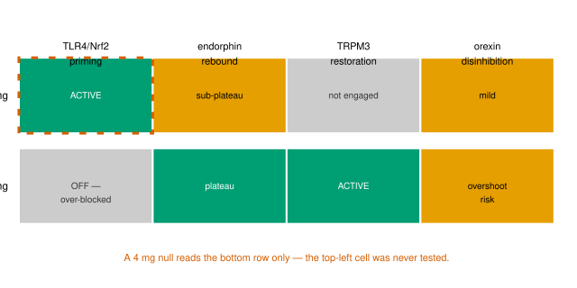

You tried LDN at 4 mg for an extended period. No benefit. You consider whether to try a lower dose — 1 mg, say — and a reasoning presents itself: if 4 mg did nothing, 1 mg will do nothing either. The greater contains the lesser.

It is the commonplace reasoning that a greater result must contain a lesser one — applied to pharmacology. It sounds reasonable. It is wrong for LDN.

This article explains why — not by attributing error to anyone, but by showing what this inference silently assumes, and why that assumption does not hold when a drug hits multiple targets at different concentrations.

---

## The short answer

The whole argument fits in one paragraph and one table. The detailed proof — separating what is established science from what is a proposed model — follows afterward.

The low-dose benefit of LDN depends on **partial** blockade of its receptor: the cell must still sense some residual signal to mount its compensatory anti-inflammatory response. Whether a receptor is partially or fully blocked is set by the drug concentration relative to that receptor's sensitivity — the ratio $c = D/K_d$, dose divided by the receptor's dissociation constant. Raise the dose and $c$ rises; the fraction $f$ of blocked receptors climbs toward 100%. At 1 mg, the microglial receptor TLR4 sits in the partial-blockade zone and the benefit mechanism runs. At 4 mg, the same receptor is blocked almost completely, the residual signal is gone, and **the 1 mg mechanism is switched off — not amplified.** Meanwhile, 4 mg engages a different target (TRPM3) that 1 mg never reaches. A null at 4 mg therefore tested the 4 mg mechanism. It did not test the 1 mg mechanism — that mechanism was not running during the 4 mg trial.

The numbers make this concrete. The occupancy column uses the standard Hill equation $f = c^2/(1+c^2)$ (established pharmacology); the benefit column uses the simple model $B \propto f(1-f)^2$ proposed in Part B of this article (a hypothesis). The parameter choices are illustrative and unmeasured: $K_d = 1$ mg, the Hill coefficient $n = 2$, and the steepness exponent $m = 2$ (the general model in Part B leaves $n$ and $m$ free):

| Dose | $c = D/K_d$ | $f$ (blocked) | $1-f$ (residual) | benefit, rel. to peak |
|------|------------|--------------------------|--------------------------|---------------------------------------------|
| 0.7 mg | 0.7 | 0.33 | 0.67 | **1.00 — the peak** |
| 1 mg | 1.0 | 0.50 | 0.50 | 0.84 |
| 3 mg | 3.0 | 0.90 | 0.10 | 0.06 |
| 4 mg | 4.0 | 0.94 | 0.06 | 0.02 |

Read the table from the bottom up. A null at 4 mg speaks only to the bottom row. It says nothing about the first two rows, because those rows describe a state — partial blockade — that a 4 mg dose never produces. And 3 mg is yet another experiment: the low-dose window has closed there too, but different mechanisms engage there — the endorphin plateau and the opening TRPM3 window. Each dose is a different experiment, and the failure of one convicts none of the others.

One clarification: switching a benefit off is not the same as causing harm. At 4 mg the low-dose mechanism simply does not run — the patient is at their untreated baseline for that pathway, not below it. The 4 mg experience is therefore a null, not a worsening — and a null is information only about the state that was actually tested.

---

## The inference rests on an unstated assumption

The argument "if 4 mg doesn't work, then 1 mg won't work" is only valid if one condition holds:

> **The superset hypothesis:** the effects of a lower dose are a subset of the effects of a higher dose.

If that is so, then testing the highest dose tests *every* dose. A failure at the high dose is a failure at all of them. The inference is clean, simple, and saves multiple trials.

The problem: this hypothesis is only true for a drug that hits **a single target** with a **monotonic dose-response curve**. LDN is neither.

---

## The chemistry: why a higher dose is not a bigger dose

The superset assumption treats a dose as a volume knob — more drug, more of the same effect. But LDN is a hormetic, multi-target drug, and that changes everything.

### What a receptor is, and why a dose can be too low

The article rests on a picture of how a drug and a receptor interact. This subsection states that picture, separating established biology from the article's hypothesis.

**What a receptor is (established).** A receptor is a protein — usually on a cell's surface — that a signaling molecule or a drug binds. Binding does something inside the cell: an **agonist** mimics the natural signal and switches a response on; an **antagonist** binds the same site, blocks the natural signal, and switches it off. For dosing, the quantity that matters is the **fraction of receptors occupied** — the share of the cell's copies of that receptor that carry a drug molecule. The Hill equation of Part A3 turns a concentration into this fraction.

**Why that fraction follows concentration (established).** Binding is a reversible equilibrium, $D + R \rightleftharpoons DR$. The dissociation constant $K_d$ is the ratio of the two rates — how fast the drug falls off over how fast it attaches. A concentration equal to $K_d$ occupies half the receptors; far above, almost all; far below, almost none. This is why the dimensionless ratio $c = D/K_d$ runs through the article: it measures a concentration in units of that receptor's sensitivity. (Mass-action, Langmuir–Hill binding — textbook pharmacology, cited in Part A3.)

For LDN's low-dose mechanism, the receptor is the microglial danger sensor TLR4, and LDN is an **antagonist** of it: it occupies the sensor and stops it from reporting a danger signal. Whether it blocks a little or a lot is set by $c = D/K_d$.

**Why too little fails (established).** If almost no receptors are occupied, the block is negligible and the cell is essentially unchanged — no response, no benefit. Below a threshold occupancy, the drug does nothing visible.

So far the picture is monotonic: more drug, more block. The puzzle is why **too much** drug also fails — why the benefit does not keep rising. That is the subject of the next subsection, hormesis.

### What hormesis is

Hormesis is a specific biological phenomenon, not a slogan: a low-level stressor triggers a *compensatory adaptive response* that is larger than the stressor itself. The classic case is the Keap1-Nrf2-ARE pathway. Under baseline conditions, the protein Keap1 binds the transcription factor Nrf2 and targets it for degradation. When a mild oxidative or inflammatory stress arrives — here, partial blockade of the microglial receptor TLR4 — reactive cysteine residues on Keap1 are modified, Nrf2 is released, translocates to the nucleus, and switches on a large battery of anti-inflammatory and antioxidant genes (hundreds, per the Nrf2/ARE literature). The *benefit is the cell's own adaptive program*, not the drug's direct action. This is the Calabrese hormesis corpus, applied to LDN dosing [@Calabrese2021Nrf2].

Two things follow from the chemistry:

- **Too little drug** fails to modify enough Keap1 — the signal never fires, Nrf2 stays bound, no benefit.
- **Too much drug** extinguishes the very stress signal that released Nrf2. At 0.5–1.5 mg, TLR4 is only *partially* blocked, so the microglia still sense the signal and mount the Nrf2 response. Above that window, TLR4 is blocked too completely — the cell no longer detects any stress, Nrf2 stays bound to Keap1, and the anti-inflammatory program collapses. The drug is still binding its receptor; it has simply stopped producing the adaptive response that made it therapeutic.

So hormesis is the *opposite* of the superset model: there is a window, and pushing past it does not give you more — it switches the benefit off. For LDN, this "too much" arm is a hypothesis: the Nrf2 hormesis mechanism is established in toxicology, but its role as LDN's clinical mechanism is not.

Two consequences follow, and both carry the article's argument:

- **Binding is continuous; benefit is windowed.** The block grows monotonically with dose. The benefit is an inverted-U. These are not contradictory: at 4 mg the receptor is *more* blocked than at 1 mg, and the benefit is *gone* — it disappears precisely because the block is too complete.

- **The two zeros are opposite failures.** Below the window, the perturbation is too weak to trigger. Above the window, it is too complete to detect. Both give zero benefit, for opposite reasons — which is why a null at 4 mg (an "above-the-window" point for TLR4) cannot be read as a null at 1 mg (an "inside-the-window" point).

### The four targets, and the doses at which each engages

LDN binds at least four distinct molecular targets, and they engage at **different dose bands**. The paper's dose-band map (ch33, hormetic reference) is:

| Dose band | Benefit mechanism | Observed side-effect |
|-----------|-------------------|---------------------|
| 0.25–0.5 mg | Micro-dose probe; may be below the Nrf2 trigger threshold | transient sleep disruption (opioid engagement) |
| 0.5–1.5 mg | **TLR4/Nrf2 hormetic priming** — anti-inflammatory benefit | "wired" / restless arousal |
| 1.5–3.0 mg | **Opioid upregulation** plateaus; benefit preserved | — |
| 3.0–4.5 mg | **TRPM3 restoration** — first-time benefit appears here; TLR4/Nrf2 extinguished | pronounced wakefulness / insomnia |
| >4.5 mg | none — all mechanisms past their optima; mu-opioid antagonism at 50 mg | opioid-withdrawal-like symptoms |

![LDN's benefit mechanisms on the dose axis: TLR4/Nrf2 priming (0.5–1.5 mg), the endorphin rebound (1.5–3.0 mg, plateau preserved to 4.5 mg), and TRPM3 restoration (3.0–4.5 mg), with the 1 mg and 4 mg trial points marked. The two trials test different windows; at 4 mg the TLR4/Nrf2 window has already closed. *Schematic — window positions from the paper's dose-band map (itself low certainty); shapes and equal heights illustrative and unmeasured; orexin disinhibition omitted for clarity. Not empirical data.*](fig5-ldn-windows.svg)

### A dose band is a benefit optimum, not a binding switch

The table above can read like a set of on/off switches: "TLR4/Nrf2 = 0.5–1.5 mg," "TRPM3 = 3.0–4.5 mg." That is not how binding works, and a reader who takes it literally is right to ask: does 1 mg not bind the receptors that 4 mg binds?

The answer is that the drug binds **all four targets at every dose**. Naltrexone is one molecule; the four receptors are all present and liganded simultaneously at any dose above zero. What changes with dose is not *whether* a target is bound but *how completely* — the fractional occupancy of each target, each on its own curve

$$ f_i = \frac{(D/K_{d,i})^n}{1 + (D/K_{d,i})^n} $$

(the established Hill occupancy of Part A3, written per target). A target with a low dissociation constant $K_{d,i}$ (high affinity) reaches high occupancy at a low dose. A target with a higher $K_{d,i}$ needs a higher dose to reach the same occupancy. So:

- **At 1 mg,** TLR4 (low $K_d$) sits near its sweet spot, while TRPM3 (higher $K_d$) is bound but only lightly occupied — too lightly for its benefit to appear.
- **At 4 mg,** TRPM3 reaches its own sweet spot, while TLR4 is over-occupied ($f \approx 0.94$), which extinguishes its benefit.

Binding is continuous; benefit is windowed. The row "TLR4/Nrf2 = 0.5–1.5 mg" therefore means "TLR4's *benefit* is largest between 0.5 and 1.5 mg" — not "TLR4 is engaged only there." At 4 mg, TLR4 is bound *more* completely than at 1 mg; it is the benefit that has vanished, for the reason in the short answer: the residual signal that sustained the adaptive response is gone. This is exactly what the Part B model encodes — a sum of windows, each target contributing $f_i(1-f_i)^{m_i}$ — and what the figure above draws as soft bumps rather than hard bands. **The dose bands are where each mechanism's benefit peaks, not where each receptor is switched on.**

The four mechanisms, in their chemistry:

- **TLR4/Nrf2 (0.5–1.5 mg).** Naltrexone is a partial TLR4 antagonist on microglia — the brain's resident immune cells. TLR4 is a danger sensor; when chronically activated, microglia release IL-1β and TNF-α, producing fatigue, cognitive slowing, and pain sensitivity. Partial blockade triggers the Nrf2-driven M1→M2 microglial switch described above. The TLR4 antagonism itself is established in vitro [@Younger2013]; the neuroinflammation it calms is documented in ME/CFS.

- **Opioid / endorphin (1.5–3.0 mg).** At standard doses (50 mg), naltrexone fully blocks opioid receptors. At low doses, the *brief* overnight blockade triggers a compensatory upregulation of endogenous endorphins — the body over-produces its own painkillers in response to the transient blockade. The ceiling is set by the cell's rate of precursor synthesis, not by drug dose — hence a plateau, not an escalation. This endorphin-rebound is documented in pain conditions [@Younger2013].

- **TRPM3 (3.0–4.5 mg).** TRPM3 is a calcium channel; calcium is the universal cellular "on switch." TRPM3 dysfunction is the most replicated ion-channel finding in ME/CFS, documented across six independent NK-cell studies [@Cabanas2021]. Naltrexone restores TRPM3-mediated calcium flux in ME/CFS NK cells in vitro [@Cabanas2018trpm3] — but this is single-concentration in vitro data, and whether it happens in living neurons, vessels, and muscle is unproven.

- **Orexin (potential benefit at high band; side-effect when it overshoots).** Naltrexone reduces microglial inflammation in the hypothalamus; that inflammation suppresses the orexin (hypocretin) wakefulness neurons. As the brake is lifted, orexin neurons fire more. The paper treats this as a potential *benefit* mechanism (improved wakefulness and cognition) — but it can tip into a "wired"/restless-arousal side effect at low dose and pronounced wakefulness/insomnia at high dose when it overshoots. The inflammation→orexin-suppression link is documented in animal models [@Grossberg2011orexinLethargy], and orexin is reduced in ME/CFS CSF — but no study has measured orexin before/after LDN in ME/CFS.

---

## What is established science, and what is a proposed model

This is the point where I must separate two very different things: the **established science** that the superset-failure argument rests on, and a **mathematical model I propose** to make that argument precise. The former is published, replicated, and citable. The latter is a hypothesis — my own construction — and I will label it as such.

---

## Part A — The established science

### A1. The empirical pattern of hormesis is real

The biphasic (inverted-U / J-shaped) dose-response — low-dose stimulation, high-dose inhibition — is documented across a large number of biological systems, in the compilation known as the Calabrese corpus [@Calabrese2021Nrf2; @Sun2020yinYangHormesis]. The *pattern* is an empirical observation, not a hypothesis. What is less settled is whether it is truly the "default" response (Calabrese's claim) versus the exception — that debate is live [@CalabreseBaldwin2003toxicologyRethinks].

### A2. The mechanism of one hormetic arm is established: Keap1-Nrf2

For the Nrf2 cluster, the mechanism of the *rising* (low-dose benefit) arm is well characterized. Keap1 holds the transcription factor Nrf2 for degradation; a mild oxidative or inflammatory stress modifies Keap1's cysteine residues, releasing Nrf2 to upregulate a broad antioxidant/anti-inflammatory gene program (hundreds of genes, per the Nrf2/ARE literature). This is established redox biology, and Nrf2 activation is the proposed generalized mediator of hormetic dose-responses [@Calabrese2021Nrf2].

### A3. The Hill equation is established, valid, and standard — but only for monotonic occupancy

A common reading of the previous section is that no established model exists at all. That is not what the section says. The **Hill equation** is published, valid, and universally standard — it is foundational pharmacodynamics (Hill, 1910), in every pharmacology textbook. It is not a suggestion. The fraction of receptors occupied by a drug of dose $D$ and dissociation constant $K_d$ is the Hill function

$$ f(c) = \frac{c^n}{c^n + 1}, \qquad c = D/K_d $$

where $n$ is the Hill coefficient — it reflects binding cooperativity, how sharply occupancy rises around $K_d$, and is a shape parameter rather than an affinity. It is the *rising* arm: occupancy rises monotonically with dose. What the equation **cannot** do is produce an inverted-U — **on its own it yields a monotonic curve.** That is an important established fact: the inverted-U requires something *beyond* single-receptor occupancy. That "something beyond" is the separate question addressed next.

### A4. Published mathematical treatments of hormesis exist, but there is no single canonical equation

The field has produced several explicit mathematical formalizations of the hormetic curve, but **no one model is accepted as "the" hormesis equation**:

- **Nweke et al. 2022** provide a statistical *bilogistic* functional form for inverted-U dose-response, reparameterized to estimate the hormetic quantity (peak stimulation, dose at peak, window width) [@Nweke2022bilogisticHormesis].
- **Xiao et al. 2022** build a dynamical (ODE) model of anti-tumor dose-response that generates non-monotonic regimes from coupled cell-population and drug-target dynamics [@Xiao2022antiTumorDoseResponse].
- **Sun et al. 2018** propose a "swinging seesaw" mechanism for *time-dependent* hormesis, where stimulatory and inhibitory effects integrate across dose and time [@Sun2018SeesawHormesis].

All three are real, published models — but they are *fits or mechanisms for specific systems*, none is a validated mechanistic model of LDN/TLR4/Nrf2 hormesis specifically. So there **are** equations that describe an inverted-U; what does **not** exist is a single, accepted, general equation for the LDN hormetic window. The empirical pattern is established; a canonical model of it is not.

---

## Part B — A proposed model (hypothesis, not established science)

I now propose a specific mathematical form. **This is my construction — a working hypothesis to make the superset-failure argument precise — and it is explicitly NOT established science.** It is not in the literature, it has not been validated, and its parameters are not measured. I present it for what it is: a scaffold.

Throughout Part B, "arm" means one of two opposing influences on the curve that push in different directions as the dose rises. One influence pushes the benefit *up*; the other, which only becomes dominant later, pulls it *back down*. It is the fight between these two that produces the inverted-U. The two arms are named below. Likewise, $B_{max}$ is the maximum benefit the curve *would* reach if the downward pull never set in — a ceiling, not the value actually reached.

### B1. Two arms: occupancy (rising) and residual tone (falling)

Hormetic benefit is not receptor occupancy itself. It is the cell's **compensatory adaptive response to a partial perturbation** — and a compensatory response requires that some *residual unblocked signal* remain to sustain it. Define:

$$ f(c) = \frac{c^n}{c^n+1} \quad\text{(occupancy, rising)}, \qquad r(c) = 1 - f(c) = \frac{1}{c^n+1} \quad\text{(residual tone, falling)} $$

For LDN's TLR4/Nrf2 mechanism, the biological claim is: partial blockade (intermediate $f$) primes the microglial Nrf2 response, but the priming is sustained only while some basal TLR4 tone remains. As $r \to 0$, the priming signal is extinguished and benefit collapses — even though the drug is still bound.

### B2. The two-arm benefit function

I propose that net benefit is the product of occupancy and residual tone. It is a *product* — and not, say, a sum — because the benefit requires two conditions to hold at the same time, and each is necessary. From B1: the response must be *triggered* (it needs enough occupancy, $f$) and it must be *sustained* (it needs enough residual signal, $r$). A shortfall in either is fatal: a weak perturbation never triggers the program, and a complete block leaves nothing to sustain it. When two requirements are both necessary, the natural form is their product — if either factor is zero, the product is zero, and the benefit vanishes. That single property is what turns a monotonic curve into an inverted-U:

$$ B(c) = B_{max}\, f(c)\, r(c)^{m} = B_{max}\, \frac{c^n}{c^n + 1} \left( \frac{1}{c^n + 1} \right)^{m} $$

where $m$ indexes how steeply benefit depends on residual tone. This form has the properties the paper describes qualitatively, and it is the *simplest* product form with an inverted-U. Differentiating gives the peak. Write $f^{\ast}$ for the value of $f$ at which $B$ is largest — the *optimal occupancy*:

$$ \frac{dB}{df} = 0 \;\Rightarrow\; f^{\ast} = \frac{1}{1+m} $$

So benefit peaks at occupancy $f^{\ast} = 1/(1+m)$ — that is, the optimum is reached when $f$ equals $f^{\ast}$, the optimal occupancy — and vanishes at both extremes ($B \to 0$ as $c \to 0$ and as $c \to \infty$).

The steepness parameter $m$ is not a fixed constant — it is a property of the system, and changing it moves the peak. As $m$ grows, $f^{\ast} = 1/(1+m)$ shrinks: the peak shifts to lower occupancy, meaning benefit is extinguished at an ever lower dose. The surface below shows $B(c,m)$ over the concentration axis $c$ and the steepness axis $m$.

**Status of B2:** a hypothesis. The product-of-Hills form is mathematically clean and reproduces the qualitative pattern, but I chose it *because* it produces the shape I wanted to demonstrate. No data establish that LDN/TLR4 benefit is literally $f \cdot r^m$. This is the point where I must be explicit that I am proposing, not reporting.

### B3. The multi-target extension

Let $i$ index each of LDN's targets. Each target has its own dissociation constant $K_{d,i}$ (the dose at which that target is half-occupied) and its own steepness parameter $m_i$, and therefore its own occupancy function $f_i$ and its own maximum benefit $B_{max,i}$. The total benefit across all targets, $B_{total}(D)$, is a sum of such windows:

$$ B_{total}(D) = \sum_{i} B_{max,i}\, f_i\!\left(\frac{D}{K_{d,i}}\right) \left(1 - f_i\!\left(\frac{D}{K_{d,i}}\right)\right)^{m_i} $$

Different $K_{d,i}$ place the windows on disjoint regions of the dose axis — the mathematical content of "non-overlapping dose optima." **Status: hypothesis**, extending the B2 hypothesis; no measured $K_{d,i}$ or $m_i$ exist for LDN's targets.

### B4. The superset-failure, conditional on the model

Within this proposed model, the superset-failure is provable. Partition the target set $\{i\}$ into $\{i: K_{d,i} \sim D_{high}\}$ and $\{i: K_{d,i} \sim D_{low}\}$. Then, with $\varepsilon_{low}(D_{high})$ denoting the leftover contribution of the $D_{low}$-active targets at $D_{high}$ — which is negligible because those targets' windows lie far from $D_{high}$:

$$ B_{total}(D_{high}) = \sum_{i \in \{D_{high}\}} B_{max,i}\,f_i\,(1-f_i)^{m_i} + \underbrace{\varepsilon_{low}(D_{high})}_{\approx 0} $$

A null at $D_{high}$ constrains only the first sum; the $D_{low}$-active targets are information-theoretically untouched. **Status: a theorem of the model — true if the model is true, not independently a fact about biology.**

### B5. What the whole model does and does not establish

It establishes (conditionally on the model): the superset inference is **mathematically invalid** for a multi-target drug whose benefit is a sum of non-overlapping two-arm windows. That is a theorem of the model.

It does **not** establish that any LDN dose works. The parameters ($K_{d,i}$, $m_i$, $B_{max,i}$) are unmeasured; no within-range LDN dose-response trial exists in any condition. The model's *value*, if any, is as a falsifiable scaffold: a four-arm within-range trial (0.5, 1.5, 3.0, 4.5 mg, n ≥ 30, crossover, 8 weeks per dose) would be the first test of whether individual curves are actually non-monotonic — and only that would tell us whether this or any hormesis equation applies.

Two points from the table bear directly on the superset argument.

**First, the targets are not interchangeable, and their benefit/side-effect relationship differs by band.** At the high band, TRPM3 restoration *and* orexin disinhibition are both candidate *benefit* mechanisms — the paper lists "TRPM3 channelopathy or orexin deficiency" as rate-limiting, and treats orexin disinhibition as improving wakefulness and cognition. The distinction is that each mechanism has its own *optimum*, and overshooting it turns benefit into side effect: excessive orexin tone tips from improved wakefulness into insomnia, and TLR4 over-blockade turns anti-inflammatory priming off. So the four targets are not four interchangeable levers that all scale up together.

**Second, the benefit bands do not overlap.** TLR4/Nrf2 benefit is at 0.5–1.5 mg and is *gone* by 3.0–4.5 mg (TLR4 over-blocking extinguishes it). TRPM3/orexin benefit appears at 3.0–4.5 mg. These are **distinct windows**, not a low-dosage and a high-dosage version of the same thing.

The consequence is direct: **a dose is not a volume.** Going from 1 mg to 4 mg does not "contain" the effects of 1 mg — it replaces the combination of engaged targets with a different combination. The TLR4/Nrf2 hormesis that operates at 1 mg is *switched off* at 4 mg, not amplified.

So the superset hypothesis fails exactly where it matters: the mechanism that might work at 1 mg is not a subset of the one that fails at 4 mg — it is a *different* target, with its own curve.

---

## Why failure at one dose does not propagate to others

The inference conflates two very different claims:

1. **"This drug is not active in this patient"** — a verdict about the drug.
2. **"This target is not the rate-limiting pathway in this patient"** — a verdict about a target.

A failure at 4 mg yields at most the second: the target combination engaged in the 4 mg band — TRPM3 restoration, orexin disinhibition, and TLR4 in its *over-blocked* state — is not the pathway limiting symptoms in this patient. And even that verdict is provisional, for the reason developed below: if the 4 mg band's targets were never actually engaged at a clinical dose, the result says nothing about any mechanism. It certainly says nothing about the TLR4/Nrf2 hormetic state or the endorphin rebound, which engage only at 0.5–3 mg — because those states *never occurred* during a 4 mg trial.

A simple analogy: a drug blocks two receptors, A and B, with 100-fold higher affinity for A. At a low dose it engages only A — and only partially. At a high dose it engages A *completely*, and B as well. Now suppose the benefit requires *partial* engagement of A (the hormetic case). A failed high-dose trial then proves nothing about the low dose: the beneficial state — partial engagement of A — never occurred during the high-dose trial; A was fully blocked, and B's engagement is beside the point. This is subtype 4a in [Part 2](../inverted-u-not-one-thing/) (concentration-dependent target selection), combined with the inverted-U: target selection is why 4 mg reaches targets that 1 mg cannot, and the inverted-U is why 4 mg *loses* the benefit that 1 mg had.

There is an even sharper version of this for LDN specifically. The TLR4 antagonism at clinical LDN doses is itself uncertain: (+)-naltrexone is a *weak* TLR4 antagonist, and an optimized derivative required a ~6,200× potency gain to reach nanomolar TLR4 antagonism [@Gao2025CIAC101TLR4]. So a 4 mg null may mean something deeper than "this target isn't rate-limiting" — it may mean **the target was never actually engaged at any dose tested**. In that case the 4 mg result says nothing about any mechanism, and the 1 mg question is entirely open.

---

## The case where the inference holds

The superset inference **is** valid in one precise case. If a drug hits a single target, with a single affinity and a monotonic dose-response curve (more dose = more occupancy = more effect, no inversion), then a high-dose failure suffices, and lower doses are redundant. This is a general pharmacology principle — it is the assumption behind standard dose-finding for many single-target, monotonic agents — not a claim specific to LDN or drawn from the paper's LDN analysis.

LDN is not in this class. Its dose-response curve is not monotonic — benefit rises and then falls within the clinical range, with target optima that do not overlap. For this kind of molecule, the superset hypothesis is not a reasonable shortcut: it is the very hypothesis the dose trial is meant to *test*, not presuppose.

### The same failure applies to other multi-target drugs

The superset-failure is not a quirk of naltrexone. It is a *structural* consequence of the dose-response shape: for any drug whose benefit is non-monotonic in dose, with several target optima, the doses cannot be nested, and a null at one dose is evidence only about that dose. The detailed catalogue is in [Part 2](../inverted-u-not-one-thing/), which lists eighteen such medications in ME/CFS. Three examples make the point concrete.

- **Rapamycin** acts on two complexes of the same protein, mTOR. It binds mTORC1 — which controls autophagy and cellular quality control — with higher affinity than mTORC2, which controls cell survival and insulin signalling. At low intermittent doses it inhibits mTORC1 and spares mTORC2, restoring autophagy and suppressing the inflammatory secretion of senescent cells. At higher daily doses it also inhibits mTORC2, and insulin resistance and immunosuppression replace the metabolic benefit. A null at the higher dose, where mTORC2 is engaged, says nothing about the low intermittent dose that spares it — the same non-overlap as LDN's TLR4 and TRPM3 windows.

- **Corticosteroids** supply at physiological replacement doses (5–10 mg prednisone) the anti-inflammatory signal the HPA axis normally gives; at supraphysiological doses they suppress the HPA axis itself, and the taper produces rebound inflammation worse than baseline. A null at a supraphysiological dose does not test the replacement dose — the two sit on opposite sides of a threshold, exactly as LDN's 1 mg and 4 mg sit on opposite sides of the TLR4 window.

- **Modafinil, duloxetine, and guanfacine** act on the prefrontal catecholamine system, whose benefit is an inverted-U in dopamine and norepinephrine tone. The dose that overshoots the optimum is different from the dose that reaches it; a null at an overshooting dose says nothing about the lower dose that tunes the circuit.

In every case the structure is identical: the benefit is a sum of dose-specific windows, so the failure of one window leaves the others untested. That is why the argument of this article is a general pharmacology principle, not an LDN-specific claim. What is LDN-specific — and taken from the paper, at low certainty — is the *position* of the bands; the *logic* of dose non-propagation is drug-independent.

To be honest about the other direction too: LDN's *overall* evidence is weak, and that does not favor any dose. The FINAL trial (n = 99) found no significant primary pain difference [@DueBruun2024LDNFibromyalgia], a responder re-analysis of six secondary outcomes was null on all [@Nielsen2026LDNFMResponder], and a meta-analysis found no between-group benefit [@Ologunowa2025LDNFMMeta]. These nulls are real and must be weighed. But they were single-dose trials — none swept the dose axis. A null at one dose, in a drug whose targets engage at different bands, is exactly the ambiguity this article is about.

---

## What this means for a dose trial

The practical corollary is simple and, for this blog, familiar: dose finding is diagnostic ([Part 3](../dose-is-diagnostic-ldn/)). Where a benefit appears and disappears on the dose axis reveals *which* mechanism is limiting. A patient who benefits only at 3–4.5 mg likely has a TRPM3 channelopathy or orexin-sensitive deficit (the paper notes these are not separable by dose alone). A patient who benefits only at 0.5–1.5 mg has TLR4-driven neuroinflammation. A failure at **a single** dose places the patient in **none** of these patterns — it only records the failure of that one dose.

For a "no benefit at any dose" to be a solid verdict, you have to have tested the relevant windows — the paper's own guidance (ch28) is that *"non-response cannot be concluded unless the low-dose window has also been tested."* A single dose point cannot produce that verdict. [Part 3](../dose-is-diagnostic-ldn/) makes the same point: *"Non-response at 0.5 mg may mean the mechanism requires a higher dose (Pattern 2)."* The reverse holds too: no benefit at 4 mg can mean the mechanism requires a lower dose.

---

## The asymmetry no one disputes

There is a sign that the superset hypothesis is fragile, and it is internal to the reasoning itself. No one defends the reverse direction: if 1 mg works, *no one* concludes that 4 mg will work. On the contrary, it is well known that a higher dose can *cancel* a benefit present at a low dose — precisely the paradox documented in [Part 1](../more-isnt-better-ldn-lda/).

If you accept that "low dose works" does **not** predict "high dose works" (because the high dose switches off low-dose mechanisms), then the symmetry is broken: doses are not interchangeable in one direction, and there is no reason to treat them as interchangeable in the other. The superset hypothesis is only coherent if both directions are interchangeable — and they are not.

---

## Certainty estimate

| Claim | Certainty |
|-------|-----------|
| Nrf2 hormesis is a real, established phenomenon (the Calabrese corpus) | High in toxicology; unproven as a *clinical LDN* mechanism — no LDN dose-response trial exists [@Calabrese2021Nrf2] |
| LDN binds TLR4, TRPM3, and opioid receptors at distinct targets | High for the targets themselves (TLR4 in vitro [@Younger2013]; TRPM3 in vitro [@Cabanas2018trpm3]; opioid [@Younger2013]) |
| The targets engage at different optimal dose bands | Low to moderate — mechanistically grounded, but no within-range dose-response trial exists in any condition (paper's own certainty: 0.30) |
| TLR4 antagonism at clinical LDN doses is real | Low — (+)-naltrexone is a weak TLR4 antagonist; an optimized derivative needed ~6,200× potency gain for nanomolar antagonism [@Gao2025CIAC101TLR4] |
| A higher dose does not necessarily reproduce the effects of a lower dose | High — a general property of non-monotonic dose-response curves |
| A failure at 4 mg does not imply a failure at 1 mg | Moderate — true if the bands engage distinct targets; false for a single-target monotonic drug |
| The superset hypothesis is valid only for a single-target monotonic drug | High — definition of monotonicity and target engagement |
| LDN itself has proven clinical benefit in ME/CFS | Low — FINAL trial null [@DueBruun2024LDNFibromyalgia], responder analysis null [@Nielsen2026LDNFMResponder], meta-analysis null [@Ologunowa2025LDNFMMeta]; no large ME/CFS RCT positive |
| Dose finding is diagnostic of the limiting mechanism | Low to moderate — the diagnostic framework is untested prospectively (the proposed HIP-B trial) |

---

*This post draws on the LDN dose-response framework developed in [@Loth2026website], which synthesizes the Nrf2 hormesis corpus [@Calabrese2021Nrf2], the microglial M1→M2 dose-dependence literature [@Kucic2021LDNmicroglia], the TRPM3 ME/CFS NK-cell findings [@Cabanas2018trpm3; @Cabanas2021], and the endorphin-rebound pharmacology [@Younger2013]. The core claim — that a higher dose is not a superset of the effects of lower doses for a non-monotonic multi-target drug — follows directly from the four mechanisms and the diagnostic pattern in the series. The evidence ceiling is explicit: no within-range LDN dose-response trial exists in any condition, and the single-dose trials that do exist are null [@DueBruun2024LDNFibromyalgia; @Nielsen2026LDNFMResponder; @Ologunowa2025LDNFMMeta]. Certainty on the framework itself is low (~0.30); the logical point about dose non-propagation does not depend on the framework being correct.*

*LDN series: [Part 1: Why More Isn't Better](../more-isnt-better-ldn-lda/) · [Part 2: The Inverted-U Is Not One Thing](../inverted-u-not-one-thing/) · [Part 3: Your LDN Dose Is a Diagnosis](../dose-is-diagnostic-ldn/) · [Part 4: The Pharmacopoeia](../pharmacopoeia-dose-meaning/)*
